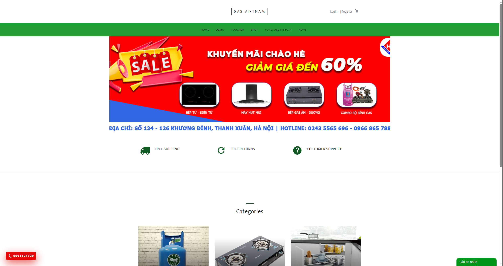
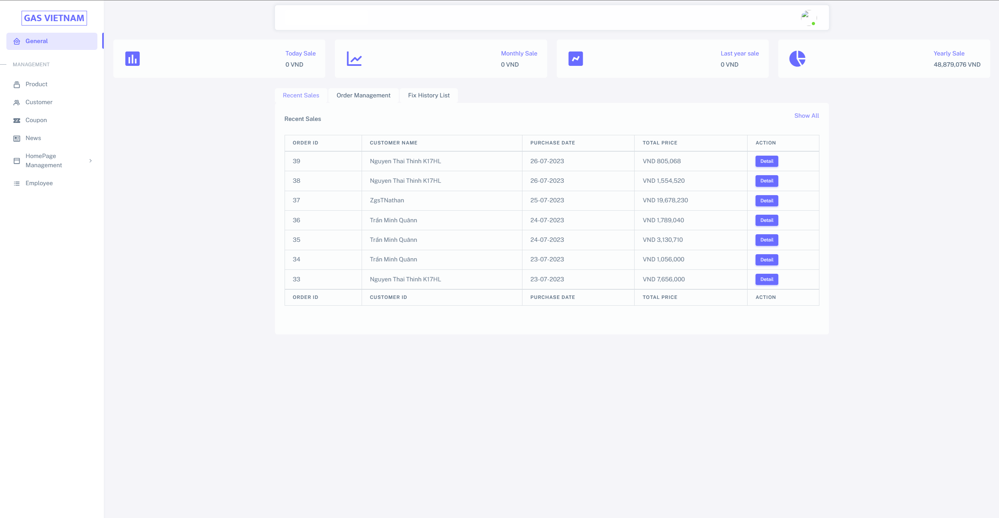

# GAS_E_COMMERCE
GAS E-Commerce   -  The e-commerce gas shop software system aims to provide a user-friendly online platform for customers to purchase gas products conveniently. It serves as a digital marketplace connecting gas suppliers with end-users, facilitating seamless transactions and efficient order management. The software system will be developed to support the operations of a gas shop, offering a wide range of gas products, secure payment processing, and inventory management capabilities.

## Project
The project - which is led by me -  is built under the Java programming language, is a local server, runs on the Tomcat server, developed for both the Client and Admin sides!

### Client 

Client site allows customers to view product information such as gas cylinders, gas stoves, or other gas-related household accessories and also will enable customers to add products to the cart, and checkout bill payment.

### Admin

